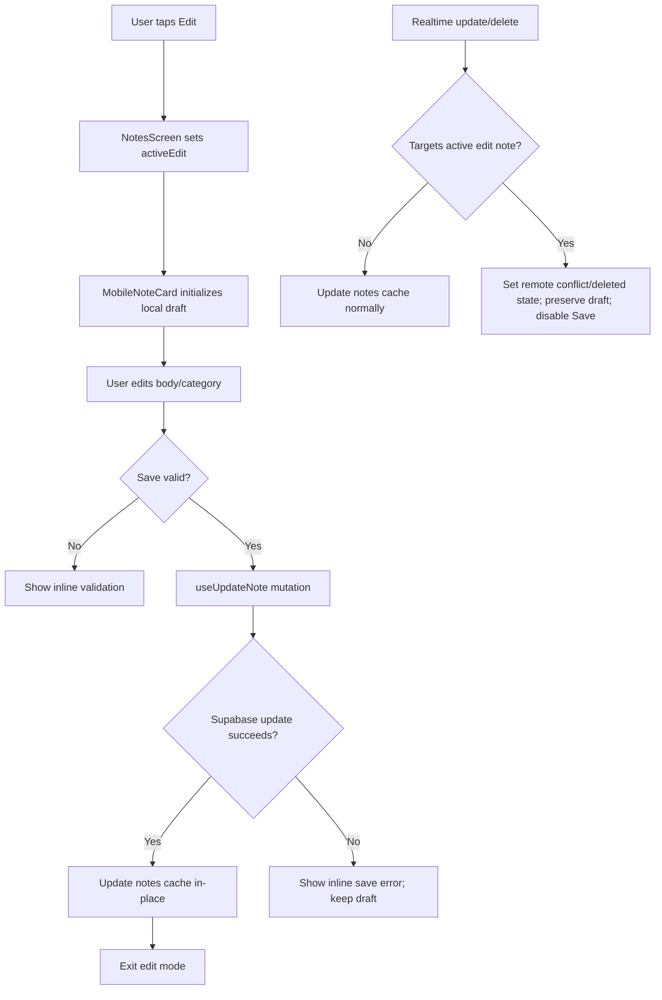

# Feature Technical Spec: Editable Notes

**Feature:** Editable Notes
**Date:** 2026-05-09
**Status:** Draft
**Upstream:** [FEATURE_SPEC.md](./FEATURE_SPEC.md)

---

## Existing Code Analysis

### Similar Functionality Audit

```text
SIMILAR FUNCTIONALITY FOUND
---------------------------
- apps/mobile/hooks/useCreateNote.ts: React Query mutation for note creation with optimistic cache insertion, rollback on failure, and local Edge Function trigger.
- apps/mobile/hooks/useUploadVoiceNote.ts: creates a voice note row, adds attachment data, and upserts the note into the shared notes query cache.
- apps/mobile/hooks/useUploadFile.ts: creates a file note where notes.content initially stores the filename; confirms file editing must update note body only, not attachment metadata.
- apps/mobile/hooks/useRealtimeNotes.ts: subscribes to notes INSERT/UPDATE/DELETE and updates the ["notes"] query cache.
- apps/mobile/components/MobileCategoryFilter.tsx: existing category pill UI and category formatting pattern using CATEGORIES from @notesbrain/shared.
- apps/mobile/app/(app)/lens-manage.tsx and apps/mobile/hooks/useLenses.ts: examples of mutation pending state, inline error handling, and Supabase update/delete hooks.
- packages/shared/src/notes.ts: upsertNoteWithAttachments helper used to preserve attachments during note cache updates.
```

**Recommendation:** Hybrid approach: create one new notes update hook, then extend the existing Notes screen/list/card components. Do not introduce a new route, database table, Edge Function, or UI dependency.

### Pattern Compliance

```text
EXISTING PATTERNS
-----------------
File organization: screen files in apps/mobile/app/(app), reusable components in apps/mobile/components, data hooks in apps/mobile/hooks, shared types/constants in packages/shared/src.
Naming convention: hooks use useX / useXMutation-style names; test IDs are centralized in apps/mobile/lib/testIds.ts; categories come from CATEGORIES in @notesbrain/shared.
Error handling: UI-level Alert for screen load failures; inline or card-level state for operation-specific failures where the user can retry; mutation errors are not swallowed.
State management: React Query for server state and local component state for transient UI state; notes use the shared ["notes"] query key.
Testing approach: Vitest + react-test-renderer smoke/unit tests under apps/mobile/test/smoke, plus root node tests for shared/backend behavior when needed.
Design system: Warm Ink tokens from apps/mobile/lib/theme.ts and Ionicons from @expo/vector-icons.
```

### Integration Point Map

| File | Risk | Coverage | Notes |
|------|------|----------|-------|
| `apps/mobile/app/(app)/notes.tsx` | Medium | Smoke test currently mocks `NotesList` | Owns selected category, active edit ID, base `updated_at`, and remote conflict state. |
| `apps/mobile/components/NotesList.tsx` | Medium | Covered indirectly by screen smoke only | Must pass edit state/callbacks, disable refresh while editing, and preserve filtering behavior. |
| `apps/mobile/components/MobileNoteCard.tsx` | High | No direct card interaction tests yet | Main UI change: read/edit states, validation, category picker, disabled controls, saving/error/conflict rendering. |
| `apps/mobile/hooks/useNotes.ts` | Low | Not directly tested | Keep `created_at DESC`; no query key change. |
| `apps/mobile/hooks/useRealtimeNotes.ts` | High | No direct realtime unit test | Must avoid overwriting an active local draft silently and expose remote conflict/delete signals. |
| `apps/mobile/hooks/useCreateNote.ts` | Low | Capture smoke covers screen, not hook internals | Reuse cache patterns; avoid changing creation/classification behavior. |
| `apps/mobile/hooks/useUploadVoiceNote.ts` | Low | Capture smoke mocks hook | No functional change; voice source metadata must remain intact after edits. |
| `apps/mobile/hooks/useUploadFile.ts` | Low | Not directly tested | File note `content` currently starts as filename; update spec treats this as editable note body only. |
| `apps/mobile/lib/testIds.ts` | Low | Used by smoke/E2E harnesses | Add selectors for edit affordances and editor controls. |
| `packages/shared/src/types.ts` | Low | Typecheck coverage | No schema change required. Add `UpdateNoteInput` only if multiple modules need the same contract; otherwise keep it local to `useUpdateNote`. |
| `packages/shared/src/constants.ts` | Low | Typecheck coverage | Reuse `CATEGORIES`; no category additions. |
| `supabase/migrations/00001_initial_schema.sql` | Low | Migration history | Existing `notes` columns already support the feature; no migration. |

## Codebase Maturity Assessment

This is a brownfield mobile codebase with active feature work and a dirty worktree. The relevant Notes code is small and direct, but test coverage is thin around card-level interactions and realtime cache behavior.

Technical debt to account for:

- `MobileNoteCard` currently combines formatting, animation, status display, and card layout in one component. Editing will make it materially larger unless subcomponents are extracted.
- `useRealtimeNotes` currently writes remote updates directly into `["notes"]` without awareness of local drafts. Editable notes needs a coordination point.
- `mergeNoteWithAttachments` in `packages/shared/src/notes.ts` currently spreads incoming before existing, so existing note fields win while attachments merge. Do not rely on this helper for applying edited server fields unless this behavior is reviewed during implementation.
- Mobile smoke tests mock `NotesList`, so new card/list interaction tests need to be added closer to `NotesList`/`MobileNoteCard`.

No legacy blocker requires a schema migration or architecture rewrite.

## Technical Approach

### Architecture Summary

Editable Notes is implemented as a mobile UI and client-side Supabase update feature:

1. Add a `useUpdateNote` hook that updates `notes.content` and/or `notes.category` for the authenticated user's note.
2. Keep list ordering by continuing to fetch and render notes sorted by `created_at DESC`.
3. Track active edit state in the Notes screen/list layer so only one card can edit at a time.
4. Render `MobileNoteCard` in read or edit mode based on the active edit ID.
5. Use local draft state inside the card for body/category, validation, save errors, and conflict/deleted messages.
6. Coordinate realtime updates so read-mode cards continue updating while active-edit card updates/deletes become explicit conflicts instead of overwriting the draft.

No new dependency, Supabase Edge Function, database table, or route is required.

## Data Model

### Existing Table: `notes`

Use the existing columns:

| Column | Update behavior |
|--------|-----------------|
| `content` | Update only when the body editor is available and the trimmed body is non-empty. For category-only saves on null/empty notes, leave content as-is. |
| `category` | Update when the selected category changes. |
| `type` | Never update. |
| `created_at` | Never update. |
| `updated_at` | Let the database trigger update it. |
| `classification_status` | Never update in the edit mutation. |
| `classification_confidence` | Never update in the edit mutation. |

No migration is required.

### Update Input Type

Keep the update input type local to `apps/mobile/hooks/useUpdateNote.ts` unless another module imports it. If shared reuse becomes necessary, move the same shape into `packages/shared/src/types.ts`.

```ts
export type UpdateNoteInput = {
  id: string;
  content?: string | null;
  category?: Category;
  expectedUpdatedAt: string;
};
```

`expectedUpdatedAt` is required for edit saves. It is compared in the Supabase update filter and is never written to the row.

## Mutation Hook Design

Create `apps/mobile/hooks/useUpdateNote.ts`.

### Hook Contract

```ts
type UpdateNoteInput = {
  id: string;
  content?: string | null;
  category?: Category;
  expectedUpdatedAt: string;
};

type UpdateNoteErrorCode = "not_authenticated" | "conflict" | "not_found" | "supabase_error";
```

The hook must:

- Require an authenticated user.
- Update only the current user's row: `.eq("id", input.id).eq("user_id", user.id)`.
- Include `.eq("updated_at", input.expectedUpdatedAt)` to detect remote changes since edit opened.
- Select `*, attachments(*)` after update so the returned row can replace the cached note without losing attachment data.
- Return a typed `NoteWithAttachments`.
- On conflict/no updated row, throw an error with code `"conflict"` or `"not_found"` so the card can show the correct inline state.

### Cache Updates

On successful mutation:

- Update `["notes"]` with the returned note.
- Preserve attachments from the returned `attachments(*)` selection. If Supabase response lacks attachments, merge with existing cached attachments for that note.
- Do not insert at the start. Preserve existing array order to maintain `created_at DESC` ordering.
- Do not invalidate `["notes"]` solely on success unless the returned row cannot be trusted.

On mutation failure:

- Do not mutate cache.
- Keep the active card draft visible.

## Notes Screen/List State

Add state near `NotesScreen` or `NotesList`:

```ts
type ActiveEditState = {
  noteId: string;
  baseUpdatedAt: string;
  remoteState: "clean" | "updated" | "deleted";
} | null;
```

Responsibilities:

- `activeEdit.noteId` controls which card is in edit mode.
- Other cards receive `isEditDisabled = activeEdit !== null`.
- Pull-to-refresh receives `enabled = activeEdit === null`; while editing, omit the `RefreshControl` from `FlatList`.
- Use `useFocusEffect` or the app's current navigation focus API in `apps/mobile/app/(app)/notes.tsx` to clear active edit state when the Notes tab loses focus. Also clear active edit state when the authenticated user changes to `null` during sign-out. Do not rely on screen unmount because tab screens can remain mounted.
- Category filter buttons are disabled while a draft is active, using the same disabled semantics as other edit controls. This avoids the active card disappearing mid-edit.

## Realtime Coordination

Current `useRealtimeNotes` directly merges updates/deletes into the notes cache. Editable Notes needs awareness of the active edit card.

Implementation:

1. Extend `useRealtimeNotes` to accept optional callbacks:

```ts
type RealtimeNoteCallbacks = {
  onRemoteUpdate?: (noteId: string) => boolean;
  onRemoteDelete?: (noteId: string) => boolean;
};
```

2. In the UPDATE handler:
   - If `onRemoteUpdate?.(updatedNote.id)` returns `true`, skip updating that note in the cache. The active card keeps its draft and enters conflict state.
   - Otherwise, update the cache as it does today.

3. In the DELETE handler:
   - If `onRemoteDelete?.(deletedNote.id)` returns `true`, skip removing that note immediately. The active card keeps its draft and enters deleted state.
   - Otherwise, remove the note as it does today.

4. In `NotesScreen`, pass callbacks that:
   - Return `true` only when the event targets the active edit note.
   - Set `activeEdit.remoteState` to `"updated"` or `"deleted"`.

5. Save is disabled when `remoteState !== "clean"`.

6. Cancel behavior:
   - For `"updated"`: clear active edit state and call `refetch()` after cancel so the server version is shown.
   - For `"deleted"`: remove the note from cache or call `refetch()` after cancel.

This keeps the user-facing conflict rules explicit without adding a server-side locking system.

## UI Component Design

### `MobileNoteCard`

Extend props:

```ts
type MobileNoteCardProps = {
  note: NoteWithAttachments;
  isEditing: boolean;
  isEditDisabled: boolean;
  remoteState: "clean" | "updated" | "deleted";
  onStartEdit: (note: NoteWithAttachments) => void;
  onCancelEdit: (noteId: string) => void;
  onSaveEdit: (input: UpdateNoteInput) => Promise<void>;
};
```

Implementation details:

- Keep read-mode layout compatible with current card.
- Add an icon button for edit using Ionicons, with `accessibilityRole="button"`, disabled state, and a 44x44 hit target.
- Show the edit button disabled for pending notes, with `accessibilityState={{ disabled: true }}` and an accessible label that says the note is still processing.
- In edit mode, initialize local draft from `note.content ?? ""` and `note.category`.
- Set `bodyEditable = note.content !== null && note.content.trim().length > 0` when edit mode opens. Notes with null/empty content show the body area as unavailable and support category-only saves.
- Use `TextInput` with `multiline` for body edits.
- Use existing category tint/pill style for a compact category picker. Reuse `CATEGORIES` from `@notesbrain/shared`.
- Use inline text for validation, save error, conflict, and deleted messages.
- Disable Save when:
  - mutation is pending;
  - `remoteState !== "clean"`;
  - no body/category changes exist;
  - `bodyEditable` is true and trimmed body is empty.
- Allow Save for category-only changes on notes with null/empty body.
- On successful save, clear error state and call parent cancel/complete callback to exit edit mode.

### Subcomponent Recommendation

To keep `MobileNoteCard` maintainable, extract local helper components in the same file or adjacent files only if the card becomes hard to scan:

- `NoteCategoryPicker`
- `NoteEditActions`
- `NoteInlineMessage`

Do not create a broad form framework.

## Test IDs

Add under `testIds.notes`:

```ts
editButton: (noteId: string) => `notes-card-${noteId}-edit`,
editInput: (noteId: string) => `notes-card-${noteId}-edit-input`,
categoryOption: (noteId: string, category: string) => `notes-card-${noteId}-category-${category}`,
saveButton: (noteId: string) => `notes-card-${noteId}-save`,
cancelButton: (noteId: string) => `notes-card-${noteId}-cancel`,
editError: (noteId: string) => `notes-card-${noteId}-edit-error`,
editConflict: (noteId: string) => `notes-card-${noteId}-edit-conflict`,
```

## Validation Rules

Define a pure helper for testability:

```ts
type NoteEditDraft = {
  originalContent: string | null;
  draftContent: string;
  originalCategory: Category;
  draftCategory: Category;
  bodyEditable: boolean;
};
```

Rules:

- `trimmed = draftContent.trim()`.
- `bodyEditable = originalContent !== null && originalContent.trim().length > 0`.
- `bodyChanged = bodyEditable && trimmed !== originalContent.trim()`.
- `categoryChanged = draftCategory !== originalCategory`.
- Valid when:
  - `bodyEditable && trimmed.length > 0 && (bodyChanged || categoryChanged)`, or
  - `!bodyEditable && categoryChanged`.
- Invalid when no fields changed.
- Invalid when `bodyEditable` is true and trimmed is empty.

The update payload sends trimmed content only when body editing is valid and body changed. Category is sent only when changed.

## Conflict Handling

### Open Edit

Capture `baseUpdatedAt = note.updated_at` when edit mode opens.

### Save

Pass `expectedUpdatedAt = baseUpdatedAt` to `useUpdateNote`.

If the update returns no rows:

- If the note still exists after a lightweight lookup, treat as `"conflict"`.
- If the note no longer exists, treat as `"not_found"`.

If distinguishing conflict from delete after a guarded save requires an extra lookup, perform that lookup. The realtime callback path catches most remote delete cases before save, but the save error path still maps no-row updates to either `"conflict"` or `"not_found"`.

### Realtime During Edit

Remote update/delete events set `remoteState` and disable Save. The draft is preserved until Cancel.

## Data Flow



## Regression Risk Assessment

| Risk | Impact | Mitigation |
|------|--------|------------|
| Editing save reorders notes | User loses original capture chronology | Preserve array order in cache and keep `useNotes` ordered by `created_at DESC`. |
| Realtime update overwrites draft | User loses local edits | Gate active note realtime events via callbacks and disable Save on conflict/delete. |
| Category filter hides active editor | User loses context | Disable category filter while editing or prevent category change until save/cancel. |
| Pending voice transcription becomes editable too early | User edits content that is about to be replaced | Disable editing for `classification_status = "pending"`. |
| File content edit accidentally renames attachment | Attachment metadata corruption/confusion | Update only `notes.content`/`notes.category`; never update `attachments`. |
| Cache update drops attachments | Voice/file indicators disappear | Select `attachments(*)` or merge existing cached attachments after mutation. |
| Tests miss card interaction regressions | Feature ships with broken inline flow | Add direct `MobileNoteCard`/`NotesList` tests, not only `NotesScreen` smoke tests. |

## Implementation Sequence

1. **Add test IDs and validation helper**
   - Extend `apps/mobile/lib/testIds.ts`.
   - Add local or exported validation helper for draft validity.
   - Unit test validation helper if exported.

2. **Create `useUpdateNote` hook**
   - Implement authenticated Supabase update with `id`, `user_id`, and required `updated_at` guard.
   - Update `["notes"]` cache in-place on success.
   - Add hook-level tests if current test setup can mock Supabase cleanly; otherwise cover through component tests.

3. **Extend realtime hook**
   - Add optional active-note callbacks.
   - Preserve default behavior when callbacks are omitted.
   - Add tests for active-note update/delete callback behavior.

4. **Add edit coordination to Notes screen/list**
   - Track active edit note ID, base updated_at, and remote state.
   - Pass edit state into `NotesList` and `MobileNoteCard`.
   - Disable refresh and category filters while editing.

5. **Implement card edit UI**
   - Add read/edit mode to `MobileNoteCard`.
   - Add body `TextInput`, category picker, Save/Cancel, validation, pending, error, and conflict/deleted messages.
   - Use Warm Ink tokens and Ionicons.

6. **Add tests**
   - Save body change.
   - Save category change.
   - Cancel discards changes.
   - Empty body validation.
   - Category-only save for empty/null content.
   - Failed save preserves draft.
   - Other cards disabled while editing.
   - Pending notes not editable.
   - Remote update/delete disables Save and preserves draft.
   - Ordering remains unchanged after save.
   - Voice/file source indicators remain visible after save.
   - Edit mutation never sends `classification_status` or `classification_confidence`, and saved notes do not reset to `pending`.
   - Active draft is discarded when the Notes tab loses focus or the user signs out.

7. **Manual/agent smoke**
   - Run `cd apps/mobile && npm test`.
   - Run `npm run typecheck` and `npm run lint`.
   - Run `npm run verify` before marking the feature complete, unless an environment blocker is documented in the execution plan.

## Migration And Rollback

### Migration

No database migration is required.

### Rollback

Rollback is code-only:

- Remove edit UI props/state from Notes components.
- Remove `useUpdateNote` hook.
- Revert optional callback additions in `useRealtimeNotes`.
- No persisted data cleanup is needed; edited note content/category are ordinary note updates.

## Human Decision Points

No unresolved human decision blocks implementation. The spec already resolves user-facing questions around note types, classification, ordering, inline editing, category creation, edited marker, lockout behavior, empty content, and realtime conflict behavior.

## Verification Commands

Primary commands:

```bash
cd apps/mobile && npm test
npm run typecheck
npm run lint
```

Full repository command when broader confidence is needed:

```bash
npm run verify
```

Memory-derived repo note: previous project memory says `cd apps/mobile && npm test` is the working mobile test command, while `npx jest` is stale for this repo.
